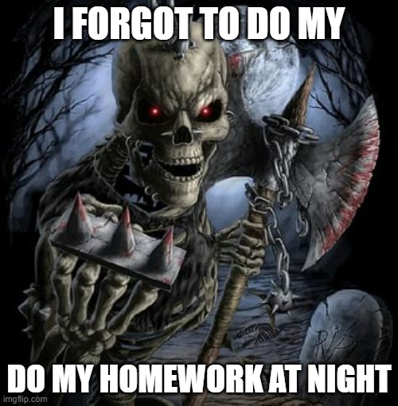

# Què és el Markdown?

Es un llenguatge de marques lleuger per organitzar i estructurar el text a partir de marques que acompañan el text. Permet escriure estils utilitzan un format fàcil d’entendre. Moltes de les seves implementacions es fan a `github`, `wordpress`, `obsidian`.
# Com utilitzar Markdown per fer documentació en GitHub?
El principal us del Markdown en [GitHub](https://github.com/) es la creació del fitxer **README.md**, el cual es una guia estructurada i organitzada de com fer ús del repositori.

==Tambe es pot fer us en *documentació, issues, pull requests, wikis i altres fitxers* .md.==

## Com podem diferenciar la informació de la nostra documentació?

~~~
Això és una línea de codi! Jo faig servir els ~. Amb 3 puc crear una línea de codi! També podem fer servir els ` per crear. 3 a dalt meu i 3 a sota meu.
D’aquesta manera podem copiar aquest tros de codi per utilitzar-ho dins d’altres documents.
~~~
### També podem crear taules amb la informació:

| Sóc una taula     | Bàsica |
| ----------- | ----------- |
| Això és un títol! | I això també! |
| Hola, sóc text  | Text del normal! |
### Les podem justificar com vulguem! 

| Mira! Cap a l’esquerre | I jo al centre! | La dreta pera aquí!|
| :---        |    :----:   |          ---: |
| A les taules      | puc modificar       | l'alineació   |
| <--   | <-->        | -->      |

---
### Podem ordenar la nostra informació! Però de quines maneres?
Podem també crear definicions!
: Com aquesta
: O questa altre.

### També podem dividir les nostres tasques.
- [x] Taules
- [x] Les línies de codi
- [x] Com fer definicions
- [] Però no les llistes

## Formes de canviar el text:

>Quines formes tenim de fer text bonic?

- *En cursiva* posant * entre les paraules que volem canviar.
- **En negreta** __també podem fer-ho així__ posant entre ** o __ les paraules.
- ~~Tatxat~~ posant entre ~~ les paraules.
- ==Important== posant-lo entre ==.

### Imatges

### Cites

> [!NOTE]
 qui dolorem ipsum, quia dolor sit amet consectetur adipisci velit, sed quia non numquam eius modi tempora incidunt, ut labore et dolore magnam aliquam quaerat voluptatem

> [!WARNING]
 qui dolorem ipsum, quia dolor sit amet consectetur adipisci velit, sed quia non numquam eius modi tempora incidunt, ut labore et dolore magnam aliquam quaerat voluptatem

> [!TIP]
qui dolorem ipsum, quia dolor sit amet consectetur adipisci velit, sed quia non numquam eius modi tempora incidunt, ut labore et dolore magnam aliquam quaerat voluptatem

Consulta la [imatges](#imatges).